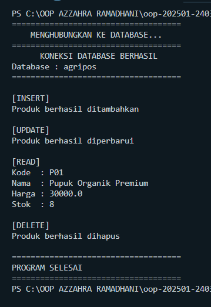
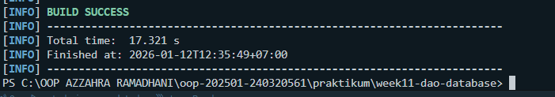

# Laporan Praktikum Minggu 11
Topik: Data Access Object (DAO) dan CRUD Database dengan JDBC

## Identitas
- Nama  : Azzahra Ramadhani
- NIM   : 240320561
- Kelas : 3DSRA

---

## Tujuan
- Mahasiswa mampu menjelaskan konsep Data Access Object (DAO) dalam pengembangan aplikasi OOP.
- Mahasiswa mampu menghubungkan aplikasi Java dengan basis data menggunakan JDBC.
- Mahasiswa mampu mengimplementasikan operasi CRUD (Create, Read, Update, Delete) secara lengkap.
- Mahasiswa mampu mengintegrasikan DAO dengan class aplikasi OOP sesuai prinsip desain yang baik.


---

## Dasar Teori
1. **Data Access Object (DAO)** adalah pola desain yang memisahkan logika akses data dari logika bisnis aplikasi, sehingga perubahan teknologi basis data tidak memengaruhi logika utama aplikasi.
2. **JDBC (Java Database Connectivity)** digunakan untuk menghubungkan aplikasi Java dengan basis data relasional seperti PostgreSQL.
3. **CRUD** merupakan operasi dasar dalam manajemen data: Create (Insert), Read (Select), Update, dan Delete.
4. **PreparedStatement** digunakan untuk mengeksekusi query SQL yang aman dari SQL injection dan lebih efisien.
5. **Interface DAO** mendefinisikan kontrak operasi database yang harus diimplementasikan oleh class konkret.

---

## Langkah Praktikum
1. Membuat struktur project `week11-dao-database`.
2. Membuat database PostgreSQL dengan nama `agripos` dan tabel `products`.
3. Membuat class Model `Product.java` untuk representasi data produk.
4. Membuat interface `ProductDAO.java` yang mendefinisikan operasi CRUD.
5. Mengimplementasikan `ProductDAOImpl.java` dengan JDBC dan PreparedStatement.
6. Membuat class `MainDAOTest.java` untuk mengintegrasikan dan menguji operasi CRUD.
7. Menjalankan aplikasi dan memverifikasi operasi CRUD di database.
8. Commit dan push dengan format:

   `week11-dao-database: implement DAO pattern and CRUD operations with JDBC`


---

## Kode Program
### 1. SQL Script - products.sql

```sql
CREATE TABLE products (
    code VARCHAR(10) PRIMARY KEY,
    name VARCHAR(100),
    price DOUBLE PRECISION,
    stock INT
);
```

### 2. Product.java (Model)

```java
package com.upb.agripos.model;

public class Product {
    private String code;
    private String name;
    private double price;
    private int stock;

    public Product(String code, String name, double price, int stock) {
        this.code = code;
        this.name = name;
        this.price = price;
        this.stock = stock;
    }

    public String getCode() { return code; }
    public String getName() { return name; }
    public double getPrice() { return price; }
    public int getStock() { return stock; }

    public void setName(String name) { this.name = name; }
    public void setPrice(double price) { this.price = price; }
    public void setStock(int stock) { this.stock = stock; }
}
```

### 3. ProductDAO.java (Interface)

```java
package com.upb.agripos.dao;

import java.util.List;
import com.upb.agripos.model.Product;

public interface ProductDAO {
    void insert(Product product) throws Exception;
    Product findByCode(String code) throws Exception;
    List<Product> findAll() throws Exception;
    void update(Product product) throws Exception;
    void delete(String code) throws Exception;
}
```

### 4. ProductDAOImpl.java (Implementasi DAO)

```java
package com.upb.agripos.dao;

import java.sql.*;
import java.util.ArrayList;
import java.util.List;
import com.upb.agripos.model.Product;

public class ProductDAOImpl implements ProductDAO {

    private final Connection connection;

    public ProductDAOImpl(Connection connection) {
        this.connection = connection;
    }

    @Override
    public void insert(Product p) throws Exception {
        String sql = "INSERT INTO products(code, name, price, stock) VALUES (?, ?, ?, ?)";
        try (PreparedStatement ps = connection.prepareStatement(sql)) {
            ps.setString(1, p.getCode());
            ps.setString(2, p.getName());
            ps.setDouble(3, p.getPrice());
            ps.setInt(4, p.getStock());
            ps.executeUpdate();
        }
    }

    @Override
    public Product findByCode(String code) throws Exception {
        String sql = "SELECT * FROM products WHERE code = ?";
        try (PreparedStatement ps = connection.prepareStatement(sql)) {
            ps.setString(1, code);
            try (ResultSet rs = ps.executeQuery()) {
                if (rs.next()) {
                    return new Product(
                        rs.getString("code"),
                        rs.getString("name"),
                        rs.getDouble("price"),
                        rs.getInt("stock")
                    );
                }
            }
        }
        return null;
    }

    @Override
    public List<Product> findAll() throws Exception {
        List<Product> list = new ArrayList<>();
        String sql = "SELECT * FROM products";
        try (PreparedStatement ps = connection.prepareStatement(sql);
             ResultSet rs = ps.executeQuery()) {
            while (rs.next()) {
                list.add(new Product(
                    rs.getString("code"),
                    rs.getString("name"),
                    rs.getDouble("price"),
                    rs.getInt("stock")
                ));
            }
        }
        return list;
    }

    @Override
    public void update(Product p) throws Exception {
        String sql = "UPDATE products SET name=?, price=?, stock=? WHERE code=?";
        try (PreparedStatement ps = connection.prepareStatement(sql)) {
            ps.setString(1, p.getName());
            ps.setDouble(2, p.getPrice());
            ps.setInt(3, p.getStock());
            ps.setString(4, p.getCode());
            ps.executeUpdate();
        }
    }

    @Override
    public void delete(String code) throws Exception {
        String sql = "DELETE FROM products WHERE code=?";
        try (PreparedStatement ps = connection.prepareStatement(sql)) {
            ps.setString(1, code);
            ps.executeUpdate();
        }
    }
}
```

### 5. MainDAOTest.java (Main Program)

```java
package com.upb.agripos;

import java.sql.Connection;
import java.sql.DriverManager;
import java.util.List;
import com.upb.agripos.dao.ProductDAO;
import com.upb.agripos.dao.ProductDAOImpl;
import com.upb.agripos.model.Product;

public class MainDAOTest {
    public static void main(String[] args) throws Exception {
        System.out.println("Hello, I'm Azzahra Ramadhani 240320561 (Week11)");
        
        // Koneksi ke database
        Connection conn = DriverManager.getConnection(
            "jdbc:postgresql://localhost:5432/agripos",
            "postgres",
            "1234"
        );

        ProductDAO dao = new ProductDAOImpl(conn);

        // CREATE - Insert data
        System.out.println("\n=== INSERT ===");
        dao.insert(new Product("P01", "Pupuk Organik", 25000, 10));
        dao.insert(new Product("P02", "Benih Padi", 15000, 50));
        System.out.println("Data berhasil ditambahkan");

        // READ - Find by code
        System.out.println("\n=== FIND BY CODE ===");
        Product p = dao.findByCode("P01");
        if (p != null) {
            System.out.println("Kode: " + p.getCode());
            System.out.println("Nama: " + p.getName());
            System.out.println("Harga: " + p.getPrice());
            System.out.println("Stok: " + p.getStock());
        }

        // READ - Find all
        System.out.println("\n=== FIND ALL ===");
        List<Product> products = dao.findAll();
        for (Product product : products) {
            System.out.println(product.getCode() + " - " + product.getName() + 
                             " - Rp" + product.getPrice() + " - Stock: " + product.getStock());
        }

        // UPDATE
        System.out.println("\n=== UPDATE ===");
        dao.update(new Product("P01", "Pupuk Organik Premium", 30000, 8));
        Product updated = dao.findByCode("P01");
        System.out.println("Data setelah update: " + updated.getName() + " - Rp" + updated.getPrice());

        // DELETE
        System.out.println("\n=== DELETE ===");
        dao.delete("P02");
        System.out.println("Data P02 berhasil dihapus");
        
        // Verifikasi delete
        List<Product> afterDelete = dao.findAll();
        System.out.println("Jumlah data setelah delete: " + afterDelete.size());

        conn.close();
        System.out.println("\nKoneksi database ditutup");
    }
}
```
---

## Hasil Eksekusi
Program berhasil dijalankan dengan hasil sebagai berikut:

- Run Main Program:


- Hasil testing:



- **CREATE**: Data produk berhasil ditambahkan ke database
- **READ (Find by Code)**: Data produk dengan kode tertentu berhasil ditampilkan
- **READ (Find All)**: Semua data produk berhasil ditampilkan
- **UPDATE**: Data produk berhasil diperbarui
- **DELETE**: Data produk berhasil dihapus dari database

---

## Analisis
- **Implementasi DAO Pattern**: Dengan menggunakan pola DAO, logika akses database terpisah dari logika bisnis aplikasi. Interface `ProductDAO` mendefinisikan kontrak operasi CRUD, sedangkan `ProductDAOImpl` mengimplementasikan detail koneksi JDBC.

- **Penggunaan PreparedStatement**: Semua operasi database menggunakan `PreparedStatement` untuk mencegah SQL injection dan meningkatkan performa. Parameter query diset menggunakan placeholder `?` sehingga lebih aman.

- **Separation of Concerns**: Class `MainDAOTest` tidak langsung menulis SQL query, melainkan memanggil method dari DAO. Hal ini membuat kode lebih modular dan mudah dimaintain.

- **Perbedaan dengan Minggu Sebelumnya**: Pada praktikum sebelumnya fokus pada design pattern (Singleton, MVC) dan unit testing. Minggu ini lebih fokus pada integrasi dengan database menggunakan JDBC dan implementasi pola DAO untuk operasi CRUD.

- **Kendala**: Perlu memastikan driver PostgreSQL JDBC sudah ditambahkan ke classpath project dan database `agripos` sudah dibuat sebelum menjalankan aplikasi.

---

## Kesimpulan
- Pola **Data Access Object (DAO)** memisahkan logika akses data dari logika bisnis, membuat aplikasi lebih modular dan mudah dipelihara.
- **JDBC** menyediakan cara standar untuk menghubungkan aplikasi Java dengan berbagai jenis database relasional.
- **PreparedStatement** merupakan best practice dalam eksekusi query SQL karena lebih aman dan efisien dibanding Statement biasa.
- Implementasi **CRUD** lengkap (Create, Read, Update, Delete) merupakan fondasi penting dalam pengembangan aplikasi berbasis database.
- Integrasi DAO dengan aplikasi OOP menghasilkan kode yang lebih terstruktur, testable, dan scalable.

---

## Quiz
1. Jelaskan mengapa DAO penting dalam pengembangan aplikasi berbasis database!
   **Jawaban:** DAO penting karena memisahkan logika akses data dari logika bisnis aplikasi. Dengan DAO, perubahan teknologi database tidak memengaruhi kode bisnis, sehingga aplikasi lebih mudah dipelihara, diuji, dan dikembangkan. DAO juga mengurangi tight coupling antara aplikasi dan database.

2. Apa keuntungan menggunakan PreparedStatement dibanding Statement biasa?
   **Jawaban:** PreparedStatement lebih aman karena mencegah SQL injection melalui penggunaan parameter placeholder. PreparedStatement juga lebih efisien karena query dapat di-compile sekali dan digunakan berulang kali dengan parameter berbeda. Selain itu, PreparedStatement mendukung penanganan tipe data yang lebih baik.

3. Jelaskan fungsi masing-masing method dalam interface ProductDAO!
   **Jawaban:**
   - `insert()`: Menambahkan data produk baru ke database
   - `findByCode()`: Mencari dan mengembalikan data produk berdasarkan kode tertentu
   - `findAll()`: Mengambil semua data produk dari database dalam bentuk List
   - `update()`: Memperbarui data produk yang sudah ada di database
   - `delete()`: Menghapus data produk dari database berdasarkan kode

4. Mengapa SQL query tidak boleh ditulis langsung di method main()?
   **Jawaban:** Karena melanggar prinsip separation of concerns dan membuat kode tidak modular. Jika SQL ditulis langsung di main(), kode akan sulit dipelihara, tidak dapat digunakan kembali (reusable), dan sulit untuk diuji. Dengan menggunakan DAO, logika database terisolasi sehingga lebih mudah untuk dimodifikasi atau diganti tanpa mengubah kode aplikasi utama.
